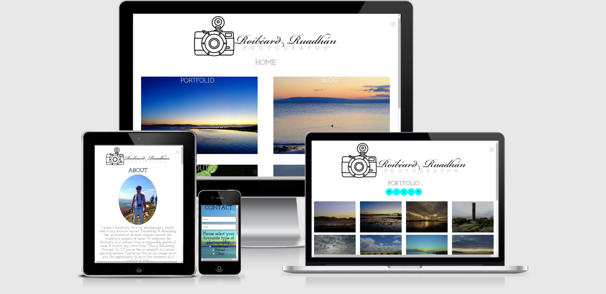
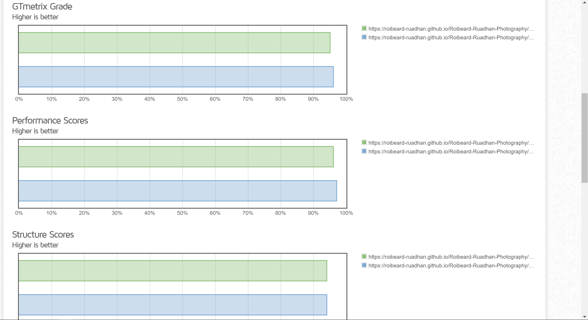

# Roibéard Ruadhán Photography

The purpose of this website is a way to share the benefits I have found with linking my two loves of meditation & most recently photography. It is a hybrid website with the mission to share my learnings of both photography & meditation, along with how they are both intertwined. I also get to share a portfolio of my most recent images which I will be updating over time. 
I am far from a professional in either area but when they are linked together I feel I can offer value through sharing my experiences of the complimentary benefits of meditation to photography & vice versa.

This website hopes to build on every aspect of the page after recently getting a new camera to capture more distinct images to constantly build on the foundation set. Also to try to add real value to anybody who enters the page by updating the Blog with relevant & hopefully inspiring information. 
### Live Prototype Demo
[Live link here](https://roibeard-ruadhan.github.io/Roibeard-Ruadhan-Photography/)

### UX Choices
 

### The Introductory page
The Introductory page was set up to develop an atmosphere of intrigue & somewhat excitement before entering the Home page.

If the user is coming in with an open perspective, a mood of deeper introspection of what to expect on entering, ideally this will bring more value to their visit. 

### Home page
The Home page gives a glimpse at what is ahead with a minimalist modern design bringing more emphasis to the images.
This page leaves open options to navigate through the website via the more prescriptive Navigation images or the hamburger button on the top right of the screen.
#Carousel*?? 

### Nav bar
Due to the importance of setting the scene for the images, the Navbar is intentionally discrete, as the aim of the page is for a minimalist & professional atmosphere. The intention is to reduce the distractions on display when scrolling through the images. 
It is clearly visible on all pages in the top right corner & with the second option of the Nav images on the Home page.

### The logo 
I created the logo design using Adobe-Spark logo creator, which I found matched the character I was looking to create for the logo image.  
I wanted to keep the logo clear & unobtrusive so the images stand out above all.
I used the font in the image as the standard font for all the content to add consistency & a professional touch to catch the eye.

### The footer
Use of Font Awesome icons without text display a contemporary, minimalist platform for social links.
Added a direct link to my Instagram account to allow users' to connect & to view other parts of my portfolio not on the website.

### Portfolio 
The 3-page portfolio is all contained within a plain white background which draws the users' attention to the images. The plain background also allows the images full expression without any external distractions.
****The images when clicked open up into a window for scanning through the images one by one using bootstrap.* TBC

The page menu was added for ease of access through the portfolio without interfering with the menu.
The colour of the menu is one of my favourite colours Cyan(colour of the ocean), which is the only other colour used on the website which is not a variant of black or white. 

### About
The About page gave me the opportunity to share what attracted me to photography & also share my love of wild-life & nature with images I have taken. 
Shares two images of me of one with my camera & another capturing the sun over the Himalayas from my travels.

### Blog
The blog page is where I get the opportunity to share my learnings from my experience of using meditation to enhance my enjoyment of photography & vice versa.
### Contact
Contains a minimalist submission form that also uses the radio button to query the users' photography interests.
The background image's intention is to set a welcoming atmosphere to invite users' to get in contact.
## Testing
Detail test of all features to assure they are working

## Validator Testing
-HTML
--No errors were returned when passing through the official

-CSS
--No errors were returned when passing through the official 

## Image Compression
I used TinyPNG to compress all of the images on the website to reduce the lag time when loading the page. 
According to Pingdom, the reduction in image size allowed the pages to load in approximately _______ seconds.

### User Stories 
As a user, I would like the opportunity to see the portfolio of other photographers 
As a user, I would like to learn about different techniques I could use to improve my photography.
As a user, I would like the opportunity to scroll portfolio's through to find images I could frame in my house.
As a user, I would like to get in touch with a photographer to possibly capture an event.
As a user, I would like to learn more about meditation & how it intertwines in many complementary ways with photography.
As a user, I will enjoy watching how the images on the website improve over time & experience with each new shot that is taken.

### Testing
I completed many online tests to check the over all performance of the website using various online tools like GTMetrix 
  
When I obtained the results I would review where I can boost performance & do a comparison test after making the required changes

Comparing performance for before & after changes

Constantly using dev tools on google & various other browsers to test new code.
I also sent the deployed webpage to various people who did user testing for me & I made sure to let them know that critical responses were very welcome & appreciated. I made many changes after receiving excellent & often critical feedback, in the knowledge that I can not see it from the users' viewpoint through the process of building it. I also received some complimentory feedback which really helped with the process of key area's I can improve further.  

### Functions/ Features
-On entering the website via the Introduction page, I used the CSS animation with keyframes to create a vibrant transition between several images. Although I was advised by a user that this does not function as well on Firefox, not recognising the transition, it does create a
nice slideshow.
-Due to the large size of the majority of my images above 5mb's, it was a challnge to make a functioning gallery. With the advice & direction of my Mentor I looked into options which allowed me to shrink my images down to a thumbnail size. This allowed me to use limited data
on page loading. I then linked the thumbnail images to the larger images in my assets folder. When the images are clicked they pop out & give the
options to scroll, swipe, expand & play. I used limited/basic Javascript to allow the functiong of the lightbox. 
-

## Checking Responsiveness
I used google inspect primaraly to inspect how each the device responded on every page. 

When sending to for user testing, I requested them to check on phone/laptop/ipad etc. I received a certain feedback from one person who checked on every browser where I was advised that Firefox browser in particular reacted differently to various functions. The main issue was the on the index.html Instroduction page the images instead of gradually transitioning every 6 seconds, they would slide across the the screen every 6 seconds.

## Bugs & other observations
[Click here for further details on bugs & general observations](/assets/readme-files/bugs-other.md)

### Deployment
The site was deployed using GitHub pages. 

Clicked into the Github repository, navigate to the settings tab.
Scroll down to Github pages & click into the new tab.
Click on the tab under Source, select Master branch & click save. 
As soon as the above is complete the deployed page url will appear on above Source & it will turn green when it is ready.

### Ackowledgments
Felipe Souza Alarcon for all his support & the information he supplied to help build
Kasia for her neverending support & endless supply of great information in times

### Content

### Media

